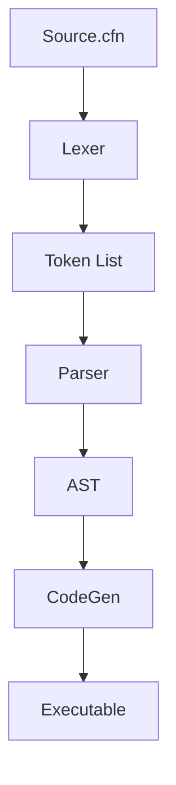

# Caffeine Compiler Internals Documentation

## Overview

The Caffeine compiler is a three-phase compiler that translates Caffeine source code (`.cfn` files) into executable programs. It consists of:

1. **Lexer** - Tokenizes source code
2. **Parser** - Builds an Abstract Syntax Tree (AST)
3. **Code Generator** - Outputs C code and compiles to executable

## 1. Lexer Module (`lexer/`)

### Key Components

- **Automata System**: DFAs for recognizing different token types
  
  - `nat_automaton`: Positive integers
  - `nint_automaton`: Negative integers
  - `preal_automaton`: Positive floats
  - `nreal_automaton`: Negative floats
  - `word_automaton`: Identifiers/keywords

- **Token Recognition**:
  
  - Uses parallel DFA execution
  - Special handling for strings (`` `...` ``) and comments (`;...\n`)

### Data Structures

```c
typedef struct {
    char* value;      // Raw string value
    TokenName name;   // Token type from enum
} Token;
```

### Error Handling

| Error Type                | Recovery             |
| ------------------------- | -------------------- |
| Unclosed string           | Abort with exit(5)   |
| Unrecognized token        | Abort with exit(6)   |
| Memory allocation failure | Abort with exit(1-4) |

## 2. Parser Module (`parser/`)

### AST Construction

The parser builds an Abstract Syntax List (ASL) using these node types:

```c
typedef struct {
    InstructionType instype;  // Statement type
    void* instruction;        // Pointer to specific node
} ASLNode;
```

### Key Functions

- `parse_program()`: Main entry point
- `parse_output()`: Handles `output` statements
- `eval_expr()`: Processes expressions to C strings
- `parse_if()`/`parse_case()`: Control flow structures

### Expression Handling

- Converts Caffeine operators to C equivalents:
  - `and` → `&&`
  - `or` → `||`
  - `=` → `==`

## 3. Code Generator (`codegen/`)

### Translation Process

1. Creates temporary `.c` file
2. Generates C code from AST
3. Invokes system C compiler (gcc)
4. Cleans up temporary files

### Key Functions

| Function                    | Purpose               |
| --------------------------- | --------------------- |
| `generate_definition_ins()` | Variable declarations |
| `generate_output_ins()`     | `printf()` statements |
| `generate_loop_ins()`       | `while` loops         |
| `generate_case_ins()`       | `if/else if` chains   |

### Type Mapping

| Caffeine Type | C Type   |
| ------------- | -------- |
| `Int`         | `int`    |
| `Flt`         | `double` |
| `Str`         | `char*`  |

## 4. Symbol Table (`symbol_table.[ch]`)

### Features

- Dynamic resizing array (starts at 16 entries)
- O(n) lookup time
- Tracks:
  - Variable names
  - Data types
  - Current values

### Key Operations

```c
void symtab_insert(...);    // Add new entry
Bool in_symtab(...);        // Check existence
char* type_in_symtab(...);  // Get variable type
```

## 5. Main Pipeline (`main.c`)

### Compilation Steps

1. Argument validation
2. File handling
3. Lexical analysis
4. Syntax analysis
5. Code generation



## Build Process

1. Run `make` in `src/` directory
2. Execute compiler:
   
   ```bash
   ./coffeemaker program.cfn output
   ```
3. Run generated executable:
   
   ```bash
   ./output
   ```

## Error Handling

| Phase   | Error Types                      |
| ------- | -------------------------------- |
| Lexer   | Invalid tokens, unclosed strings |
| Parser  | Syntax errors, type mismatches   |
| CodeGen | C compilation errors             |

## Memory Management

- Dynamic allocation for:
  - Token list (lexer)
  - Abstract Syntax List (parser)
  - Symbol table
- All components include cleanup routines

## Example Walkthrough

For the input:

```cfn
Int x <- input;
output `Value: %d`, x;
```

The compiler:

1. Lexer produces: `DTYPE, WORD, ASSN, INPUT, SEMI, OUTPUT, STR, COMM, WORD, SEMI`
2. Parser builds AST with definition and output nodes
3. CodeGen outputs:
   
   ```c
   int x; scanf("%d", &x);
   printf("Value: %d", x);
   ```

## Limitations

- No function support
- Basic error recovery
- Simple symbol table implementation

This documentation covers the core architecture and implementation details of the Caffeine compiler. The modular design allows for future expansion of language features and optimizations.
